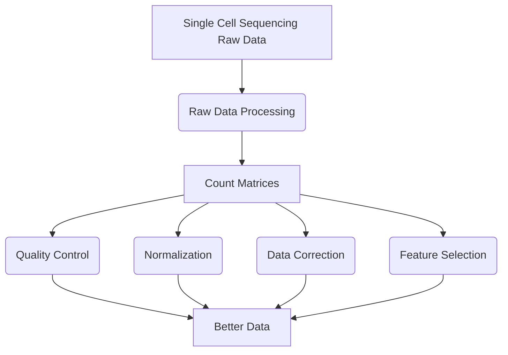
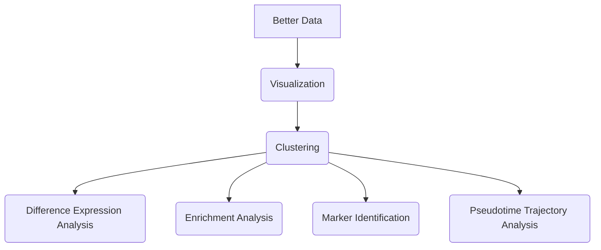

# 单细胞分析踩坑实录

无情佛系扎心老铁 2021-8-29

## 序

**我们从两个问题入手：**

- 细小组织的划分问题

  有时，我们研究的目标可能是一个具体细小的局部组织。比如研究肠绒毛变化，研究毛囊发育过程的变化，研究叶片气孔开关的调控，研究雄性不育过程的花粉败育。

  由于技术的限制，我们很难精确地选择目标部位，只能模糊地取小肠的一部分，挑取一大片皮肤，使用整个叶片，使用整个雄蕊等，然后进行转录组测序。在这样的情况下，目标组织在整个测序样本中只占很小的一部分，测序样本大概率无法呈现我们关心的信息。

  这好比把一小勺橙汁加到了一杯葡萄酒里。你的目标本想研究不同橙汁的甜度是否有差异。但橙汁的味道早被稀释了，反而最后杯子里饮料的味道更多反映的是葡萄酒的味道。

  对于这种情况，大部分人也能清楚已有方法的局限。但除非有技术可以对目标组织进行精确取样，或者对以样本中的细胞为单位进行研究，否则以上的问题无法解决。

- 细胞的异质性问题

  哪怕是一个单一的组织，也不仅仅只有一种细胞，而实际上是各种细胞的大杂烩。

  以小鼠心脏组织为例，可能直觉上认为心脏主要是一团会跳动的肌肉，主要是心肌细胞（Cardiomyocytes）。但如果进行单细胞检测（如下图），可以看出心脏的细胞构成实际上非常丰富，不仅有心肌细胞，还包括成纤维细胞（Fibroblasts）、内皮细胞（Endothelial cells）、血管内皮细胞（Vessel Endothelial）、心外膜细胞（Epicardial）、巨噬细胞（Macrophages）、淋巴细胞（Lymphocytes）、平滑肌细胞（Smooth muscle）等，而成纤维细胞则又可以进一步分为若干个子亚群。

  

  问题往往就出在这里：常规转录组检测的是样本中所有细胞的均值，而我们研究目标（例如，某种疾病的发生机制）却可能只与其中的某种细胞相关。例如，如果研究心脏纤维变性，最佳方案应该只针对心脏成纤维细胞进行检测和比较，而普通转录组往往是检测整个心脏组织。如果我们研究胰腺的胰岛素分泌变化，那么理论上应该针对胰岛α细胞进行检测比较，而普通转录组可能是对整个胰腺进行检测。

  这种期望（研究范围应该限定在特定类型细胞中）与现实（只能检测各种混合细胞的均值）巨大裂隙，导致了以往的发育、疾病、环境应答等的组学研究只能得到一个概要性的结论，而难以在更加精细地在细胞尺度给出一个清晰的解答。要弥补这个裂隙，只能使用单细胞检测的方法。https://www.sohu.com/a/318595293_278730

新的问题需要新的数据类型（新的数据采集方式），而新的数据类型需要根据他的特点开发新的数据分析方式。

2009年北京大学汤富酬教授在博士后期间发表了世界第一篇单细胞mRNA测序的文章，开启了单细胞组学时代（scRNA-seq）。https://pubmed.ncbi.nlm.nih.gov/19349980/

**目前主要有两种策略来实现单细胞测序。**

第一种，也就是目前大多数人所想象的那样，将单个细胞分离出来，并独立构建测序文库，最终进行测序的路线。我们可以通过流式细胞术（含微流体芯片），或者激光捕获显微切割（LCM）来实现。流式细胞术估计大家比较熟悉，就不多讲了，它主要运用于细胞样品。对于组织切片样品来说，主要是通过LCM来获取单细胞，原理可以见下面的示意图。

近年来多采取第二种策略：基于标签（barcode）的单细胞识别。它的主要思想是，给每个细胞加上独一无二的DNA序列，这样在测序的时候，就把携带相同barcode的序列视为来自同一个细胞了。这种策略，可以通过一次建库，测得数百上千个单细胞的信息。我遇到的数据就是这么测的。

**那单细胞测序数据有什么特点呢？**

大数据的四大特点几乎都在单细胞数据中体现了：

1. 海量性 

   单细胞的海量性不仅体现在单次捕获的细胞数和基因数上，而是每天不同的实验室产生对单细胞不同的刻画，不同器官，不同物种，不同技术层面。

2. 多样性 

   多样性翻译到单细胞这就是不同的模态，不仅有表征丰度的矩阵数据，还有空间数据（空间转录组等），结构数据。

3. 高速性和易变性

   高速和易变就不多说了，目前有不少文章发出来就是一个数据库，往往有一个新的技术头号玩家完了，二号基本没机会了。

https://cloud.tencent.com/developer/article/1646016#

**那单细胞数据分析需要我们做什么呢？**

详见此文https://pubmed.ncbi.nlm.nih.gov/31217225/，以下两流程图方框代表数据，圆框代表数据处理方法。具体内容详见正文，都有现成的方法🤪

- Pre-processing



- Downstream Analysis（不全）




总而言之，单细胞测序技术是我们中国人研发的方法，单细胞数据分析不学不是中国人！🐶

话不多说，开启愉zha快xin的单细胞数据分析（做菜）踩坑之旅。

## Part I 磨刀不误砍柴工——预备知识

- Linux

  http://www.ehbio.com/tutorial/%E7%94%9F%E4%BF%A1%E5%AE%9D%E5%85%B8-Linux%E6%95%99%E7%A8%8B.pdf

- Python

  http://www.ehbio.com/tutorial/%E7%94%9F%E4%BF%A1%E5%AE%9D%E5%85%B8Py3_course.pdf

- R

  http://www.ehbio.com/tutorial/%E7%94%9F%E4%BF%A1%E5%AE%9D%E5%85%B8-R%E5%AD%A6%E4%B9%A0%E6%95%99%E7%A8%8B.pdf

## Part II 准备家伙事儿——搭建环境

### 2.1 服务器安装anaconda并创建虚拟环境

https://blog.csdn.net/wyf2017/article/details/118676765

### 2.2 在虚拟环境中安装R

https://www.jianshu.com/p/2621abd6493a

之后再添加一些channel

https://blog.csdn.net/weixin_39278265/article/details/84782550

### 2.3 安装R包Seurat（第一个坑）

https://satijalab.org/seurat/articles/install.html

期间可能会报各种各样的错误，部分解决方法如下：

- R 版本问题：参考2.2，把需要的r-base版本，也就是R再下一遍。

- 部分包不一致导致它们安不上问题：参考2.2，用conda，bioconductor试试，也可以用源文件本地安装方式：

  R: install.packages(“xxxx.xxx”,repo=NULL,type=”source”)

  conda: conda install --use-local xxx.xxx

- 部分包抽风报错（R无法读入它的lib等问题）：卸了重装一遍就好，就是欠揍啊！

### 2.4 安装jupyter lab并添加R kernel

conda install jupyter

进入R

install.packages('devtools')

devtools::install_github('IRkernel/IRkernel')

IRkernel::installspec(name = 'ir版本', displayname = 'R+版本')

这步网上多数的教学是不好的

### 2.5 远程登入jupyter lab

https://zhuanlan.zhihu.com/p/367020783

当然也可以加上nohup

### 2.6 安装Cell Ranger并下载参考基因组

https://support.10xgenomics.com/single-cell-gene-expression/software/pipelines/latest/installation

### 2.7 根据需要安装其他包

scanpy monocle3 等

## Part III 洗菜——raw data处理

https://www.jianshu.com/p/51e0ef0c7301

注意这里不需要cat，这样就可以  --sample=CC5F0-1,CC5F0-2,CC5F0-3,CC5F0-4

如果有好几个batch，可以写一个for循环放在.sh文件。

这个数据量一般很大，通常要加nohup跑，运行时间以小时或天来计算。


## Part IV 择菜——表达数据预处理

以下内容基于两篇官方参考教学：

https://scanpy-tutorials.readthedocs.io/en/latest/pbmc3k.html

https://satijalab.org/seurat/articles/pbmc3k_tutorial.html

这里用python跑scanpy，因为之后要用到一个特殊的python包。

### 4.1 载入必须的包

```python
import numpy as np
import pandas as pd
import scanpy as sc
import matplotlib.pyplot as plt
import os
from anndata import AnnData
from scipy.sparse import issparse
import desc
from matplotlib.pyplot import rc_context

os.chdir('/s/e/tanbowen')#切换工作路径
```

### 4.2 读取表达矩阵、计算线粒体基因相关（下步做质量控制）、画violin图、做质量控制（滤细胞）

```python
Name = []
a = ()
for i in range(1,5):
    name = 'Donor'+str(i)
    path = '/s/e/tanbowen/cellranger_'+name+'/outs/filtered_feature_bc_matrix/'
    adata = sc.read_10x_mtx(
        path,  # the directory with the `.mtx` file
        var_names='gene_symbols',                # use gene symbols for the variable names (variables-axis index)
        cache=True) 
    adata.var['mt'] = adata.var_names.str.startswith('MT-')  # annotate the group of mitochondrial genes as 'mt'
    sc.pp.calculate_qc_metrics(adata, qc_vars=['mt'], percent_top=None, log1p=False, inplace=True)
    sc.pp.filter_cells(adata, min_genes=200)
    sc.pp.filter_cells(adata, max_genes=6000)
    adata = adata[adata.obs.pct_counts_mt < 20, :]
    exec("adata_Donor%s = adata"%i)
    Name.append(name)
    a = a+(adata,)
```

**为什么要做质控**？

在细胞分离过程中的细胞损伤或者文库制备的失败（无效的逆转录或者PCR扩增失败），往往会引入一些低质量的数据。这些低质量的数据的主要特点是：

1. 细胞整体上的counts值少（列）

2. 基因的低表达（行）

3. 线粒体基因或者spike-in的比例相对较高

如果这些损伤的行或者列，没有被移除的话，可能会对下游的分析结果产生影响。所以我们在进行分析之前，一定要率先移除这些低质量的行与列。（一开始的理解，后面整个流程做完之后，或许理解会更多，那么接下来在做详细的补充）

**质控的指标**

1. 每一个细胞所有基因的counts值之和

   在文库制备的过程中，可能因为细胞的裂解或cDNA捕获和扩招效率的低下，而使得RNA的丢失。具有较小的counts值之和的细胞被认为是低质量的细胞，考虑被去除。

2. 每一个细胞中单个基因的表达数量

   多样化的转录本如果没有被成功的捕获到，因此任何一个细胞中有很少的基因表达，被认为是低质量的，考虑被去除。

3. 每一个细胞中，spike-in序列/线粒体基因占总的counts值的比例

   每个细胞中添加的spike-in序列（人为添加的表达量的参照系）的浓度都是等量的。如果spike-in的比值很高，那么就意味着在实验的过程中，大量的转录本丢失。

   同样，线粒体基因的高比例，也意味着这可能是由于穿孔细胞的细胞质RNA丢失，从而产生低质量的细胞。理由是，在存在适度细胞损伤的情况下，细胞膜上的孔允许单个转录物分子外排（丢失），但过小而无法使线粒体逸出，从而导致线粒体转录物的相对富集。
   https://blog.csdn.net/weixin_40640700/article/details/114538295

### 4.3 批次整合、滤基因、保存数据、标准化、挑选出高表达基因

```python
adata_all = adata_Donor1.concatenate(t,batch_key = 'obs', batch_categories = Name)
adata_all.obs.rename(columns={'obs':'batch'},inplace=True)
sc.pp.filter_genes(adata_all, min_cells=3)

adata_all.raw=adata_all

desc.normalize_per_cell(adata_all, counts_per_cell_after=1e4)
desc.log1p(adata_all)
sc.pp.highly_variable_genes(adata_all, n_top_genes = 2000, batch_key = None)
adata_all = adata_all[:, adata_all.var['highly_variable']]
```

## Part V 特殊工序——desc去批次效应并聚类可视化

文章：https://www.nature.com/articles/s41467-020-15851-3

官方网址：https://eleozzr.github.io/desc/

### 5.1 scale_bygroup

正常应该是这样一步就可以了

```python
scale_bygroup(adata_all, groupby='batch', max_value=6)
```

可能会报关于numpy错。可以将参照源码稍作修改

```python
def _log1p(x):
    if issparse(x):
        np.log1p(x.data, out=x.data)
    else:
        np.log1p(x, out=x)
    return x


def log1p(data, copy=False):
    if copy:
        data = data.copy()
    if isinstance(data, AnnData):
        _log1p(data.X)
    else:
        _log1p(data)
    return data if copy else None

def get_mean_var(X):
# - using sklearn.StandardScaler throws an error related to
#   int to long trafo for very large matrices
# - using X.multiply is slower
    if True:
        mean = X.mean(axis=0)
        if issparse(X):
            mean_sq = X.multiply(X).mean(axis=0)
            mean = mean.A1
            mean_sq = mean_sq.A1
        else:
            mean_sq = np.multiply(X, X).mean(axis=0)
        # enforece R convention (unbiased estimator) for variance
        var = (mean_sq - mean**2) * (X.shape[0]/(X.shape[0]-1))
    else:
        from sklearn.preprocessing import StandardScaler
        scaler = StandardScaler(with_mean=False).partial_fit(X)
        mean = scaler.mean_
        # enforce R convention (unbiased estimator)
        var = scaler.var_ * (X.shape[0]/(X.shape[0]-1))
    return mean, var


def scale_bygroup(adata,groupby,max_value=6):
    res=None
    assert isinstance(adata,AnnData),'adata must be AnnData class'
    adata.X=adata.X.toarray() if issparse(adata.X) else adata.X
    if groupby in adata.obs.keys():
        df=pd.Series(adata.obs[groupby],dtype="category")
        for category in df.cat.categories:
            tmp=adata[df==category]
            tmp=tmp.X.copy()
#             tmp=np.asarray(tmp)
            mean0,var0=get_mean_var(tmp)
            sd0=np.sqrt(var0)
            sd0[sd0<=1e-5]=1e-5
            tmp-=mean0
            tmp/=sd0
            if max_value is not None:
                tmp[tmp>max_value]=max_value
            adata.X[df==category]=tmp.copy()
    else:
        print("Warning: The groupby:"+str(groupby)+ "you provided is not exists, we scale across all cells")
        res=adata.X
        #avoid all 0 columns
        mean0,var0=get_mean_var(res)
        sd0=np.sqrt(var0)
        sd0[sd0<=1e-5]=1e-5
        if issparse(res):
            res=res.toarray()
        res-=mean0
        res/=sd0
        res[res>max_value]=max_value
        adata.X=res
    return adata
```

再试一下

```python
scale_bygroup(adata_all, groupby='batch', max_value=6)
```

可能报另外一个关于tensor的错

再加一行

```python
adata_all.X = adata_all.X.todense()
```

这样应该就没问题了🤣

### 5.2 desc

```PYTHON
adata_all = desc.train(adata_all, dims=[adata_all.shape[1], 512, 64], tol=0.005, 
										n_neighbors=10,
										batch_size=256, 
										louvain_resolution= [1.0],#可用多个分辨率
                    save_dir="seurat", do_tsne=True, learning_rate=300,
                    do_umap=True, num_Cores_tsne=4,
                    save_encoder_weights=True)
```

三个重要输出结果 

聚类结果：adata_all.obs['desc_1.0']

高质量（相较PCA来说）低维表达：adata_all.obsm['X_Embeded_z1.0']

UMAP坐标（用于可视化）：adata_all.obsm['X_umap1.0']

### 5.3 保存结果

```python
adata_all.write('desc_result_batch_hvg2000_res1.h5ad')
```

### 5.4 自定义分群

```python
adata_all.obs['type'] = 'B'

for i in range(1,3):
    name = 'Donor'+str(i)
    adata_all.obs.loc[adata_all.obs_names.str.endswith(name),'type'] = 'A'

adata_all.write('desc_result_batch_hvg2000_res1.h5ad')
```

### 5.5 可视化

```python
with rc_context({'figure.figsize': (18, 12)}):
  sc.pl.scatter(adata_all,basis='umap1.0',
                color='desc_1.0',save='_batch_hvg2000_res1_desc.png',
                legend_fontsize = 'x-large', size = 7)
```

## Part VI 做菜——下游分析（都是坑啊）

### 6.1 转化h5ad数据至seurat对象

Seurat4需要R4.1.0，我们先用R4.1.0

```R
library(Seurat)
library(SeuratDisk)
library(ggplot2)
library(plyr)
```

```R
Convert("desc_result_batch_hvg2000_res1.h5ad", "desc_result_batch_hvg2000_res1.h5seurat")
seuratObject <- LoadH5Seurat("desc_result_batch_hvg2000_res1.h5seurat")
saveRDS(seuratObject, "seuratObject.rds")
```

上述能否跑通真的是要靠运气了，无情啊！

### 6.2 根据需求按自定义的idents聚类可视化

idents就是自定义的细胞群group，也可以用seurat操作。

```R
seuratObject <- NormalizeData(seuratObject)#转换是用的raw，需要再次标准化
group = c('desc_1.0','batch','type','stage')
for (i in group){
    name <- paste(i,'.png')
    p <- DimPlot(seuratObject, group.by = i,reduction = 'umap1.0',label = TRUE,pt.size = 0.05)
    ggsave(plot = p, filename = name,width = 9,height = 6)
}
Idents(object = seuratObject) <- seuratObject@meta.data$`desc_1.0`#这样以后不用group.by，默认是这个idents
```

u1s1，ggplot2画图就是香啊。

### 6.3 差异表达分析

- FindAllMarkers，每个群按avg_log2FC值取前10个基因

```R
seuratObject.markers <- FindAllMarkers(seuratObject, only.pos = TRUE, min.pct = 0.25, logfc.threshold = 0.25)
write.table(x=seuratObject.markers,file = '',quote = 'false', sep = '\t')
top10 <- seuratObject.markers %>% group_by(cluster) %>% top_n(10, avg_log2FC)
write.csv(top10,'top.csv')
```

- FindMarkers

```R
for (i in c(0:1)){
    f <- FindMarkers(object = seuratObject,`ident.1` = 'A',group.by = 'type',subset.ident = i)
    de <- f %>% filter(avg_log2FC>0 & p_val_adj<0.05 )#这里不同
    g <- as.data.frame(rownames(de))
    name <- paste('up',as.character(i),'.csv',sep = '')
    write.table(g,name,sep = ',',quote = FALSE,row.names = FALSE,col.names = as.character(i))
}
for (i in c(3:4)){
    f <- FindMarkers(object = seuratObject,`ident.1` = 'A',group.by = 'type',subset.ident = i)
    de <- f %>% filter(avg_log2FC<0 & p_val_adj<0.05 )#这里不同
    g <- as.data.frame(rownames(de))
    name <- paste('down',as.character(i),'.csv',sep = '')
    write.table(g,name,sep = ',',quote = FALSE,row.names = FALSE,col.names = as.character(i))
}
```

### 6.4 富集分析

把刚才的csv文件放在下面网站里面手动点点点

https://metascape.org/gp/index.html#/main/step1

然后把结果给懂生物学的人（这我完全不懂🌶🤪）

### 6.5 细胞群标注

也就是给刚刚的无监督聚类结果贴上标签。

懂生物学的人分析得到细胞群名称，用plyr::mapvalue新加一列idents即可。

### 6.6 拟时轨迹分析（第三个蜜汁大坑）

我们将刚刚得到的seuratObject保存

```R
saveRDS(seuratObject, "seuratObject.rds")
```

再新建一个R3.3.6的环境

```R
library(Seurat)
library(ggplot2)
library(dplyr)
# library(SeuratObject)
library(monocle3)#我用的0.2.3
```

```R
cds <- new_cell_data_set(expdata,cell_metadata = cell_metadata,gene_metadata = gene_annotation)

# cds <- preprocess_cds(cds,method = 'PCA',num_dim = 30)
#如果用他的PCA报有关irlba的错误，可以降一下版本
# cds <- reduce_dimension(cds)

reducedDims(cds)$PCA <- as.data.frame(dat@reductions$Embeded_z1.0@cell.embeddings)
#可以不用他的PCA
reducedDims(cds)$UMAP <- as.data.frame(dat@reductions$umap1.0@cell.embeddings)
#可以不用他的UMAP
cds <- cluster_cells(cds,reduction_method = 'UMAP')

cds <- learn_graph(cds,use_partition = FALSE)#use_partition默认是TRUE,如果之后的plot_cells 有灰色部分就设置成FALSE

cds <- order_cells(cds,root_cells = rownames(subset(cds@colData,desc_1.0=='2')))
#需要手动设置细胞节点
plot_cells(cds,
           color_cells_by = "pseudotime",
           label_cell_groups=FALSE,
           label_leaves=FALSE,
           label_branch_points=FALSE,
           graph_label_size=1.5)
```

最终图片


当然可以用自己分的细胞群再画下。

坑警告：R4.1.0会在learn_graph报各式各样的错误，尚未有解决方案，无情哈拉少！

## VII 尾声

千言万语汇成一句感恩，感谢。希望以后能够有机会继续做单细胞分析。未完待续~
